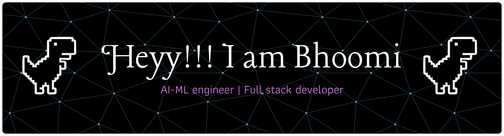

  

 

## Ⅰ. About

<table>
<tr>
<td width="60%" valign="middle">

<h3>CS (AI) student who likes to build things that make me learn.</h3>

I’m a CS (AI) student at KLE Tech, constantly somewhere between 
<strong>“I wonder if this is possible”</strong> and 
<strong>“okay, now I have to make it work.”</strong>

My interests live around <strong>AI/ML, RAG, knowledge graphs, 
intelligent systems, and navigation</strong>. I enjoy projects where 
there’s more to solve than just writing the code — understanding the 
problem, figuring out the architecture, experimenting with ideas, 
and debugging things that absolutely did not want to be debugged.

I learn by building, and most of my learning happens somewhere between 
a terminal, a half-finished idea, and far too many tabs open at 1 AM.

When I’m not building something, you’ll probably find me sketching, 
exploring Vedic astrology, or going down another completely unexpected 
rabbit hole.

<strong>Building things. Breaking things. Learning things. 
Repeat.</strong>

</td>

<td width="40%" align="right-" valign="center">

</td>
</tr>
</table>

## Ⅱ. Featured Builds

> **NeetiAi** — AI-powered personal finance platform for Indian students
> Full ML pipeline: XGBoost expense categorizer (F1 0.946), weekly spend forecasting, SciPy budget optimizer, and **Kuber** — a DistilBERT intent chatbot (F1 0.971) with an optional LLM rephrase layer. Trained models own every number; the LLM only ever touches phrasing, never generates a figure.
> `Next.js` `FastAPI` `XGBoost` `DistilBERT` `Supabase` `SciPy`

> **Memora** — AI-powered digital identity & knowledge graph engine · built for the Memoryverse Hackathon
> Causal graph (`LED_TO` → `BUILT_ON` → `APPLIED_IN`) linking growth, skills & experience · OCR ingestion · RAG chat with citations · migrated from local Ollama to Groq's hosted API for production
> `FastAPI` `ChromaDB` `NetworkX` `Groq` `D3.js` `Docker` → **[Live demo ↗](https://memora-production-2406.up.railway.app)**

> **Project Dhruva** — phone-only, GPS-denied dead-reckoning navigation · Smart India Hackathon, ISRO problem statement SIH26168
> Native Android app (recorder + live navigate screen) built from scratch, paired with a live web dashboard tracking drift and map-matching — built end-to-end with a teammate, from empty project to real field-tested rides.
> `Kotlin` `Android Studio` `Sensor Fusion` `OSMDroid`

> **Breath Mirror** — a creative interactive web experience using mic input and hand-gesture tracking
> Real-time breath detection paired with a reactive visual mirror — full-stack, built for the sake of building something that felt alive.
> `React` `Vite` `FastAPI` `MediaPipe`

<b>more builds ›</b> RakshaNet · KarigaarConnect · WiDS Datathon · ML_ODYSSEY · Colony · APNILEAP

 

- **RakshaNet** — cybersecurity platform targeting digital-arrest scams and UPI fraud, built for the Bharat Pragati track with a full pitch deck and workflow docs
- **KarigaarConnect** — a worker–employer platform prototype for India's informal labor sector
- **WiDS Datathon** — wildfire proximity prediction using a survival-analysis ensemble (GBSA + LightGBM, seed averaging, IPCW weighting)
- **ML_ODYSSEY** — a gamified, space-themed ML learning tool, built as a self-contained HTML experience
- **Colony** — community super-app for the Savji samaj with end-to-end encrypted anonymous reporting ("Guptchar") and UPI payments — `React Native` `Expo` `Supabase`
- **APNILEAP** — governance SaaS with a 5-agent AI system for industry–academia workflows — `Anthropic API` `Automation`

## Ⅲ. Stack

**Languages**

**AI / ML / LLM**

 

**Backend**

**Frontend**

**Mobile & Infra**

## Ⅳ. GitHub Stats

**[Gmail](mailto:bhoomibankapur.3@gmail.com)** · **[LinkedIn](https://www.linkedin.com/in/bhoomi-bankapur)** · **[Memora Demo](https://memora-production-2406.up.railway.app)**

